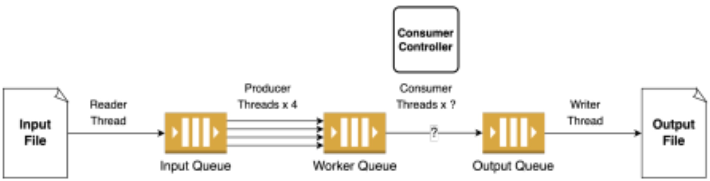

## Project Name: The producer-consumer problem 

## Descriptions
This producer-consumer problem framework, as shown in the diagram, consists of a Reader thread, four Producer threads, multiple Consumer threads, a Writer thread, and a Consumer Controller that adjusts the number of Consumer threads based on the workload. Since all three queues may be accessed simultaneously by multiple threads, race conditions must be considered.

## Implementaion and Experiments
The implementation details, as well as experiments on various hyperparameters, can be found in the IMPLEMENTATION.pdf.